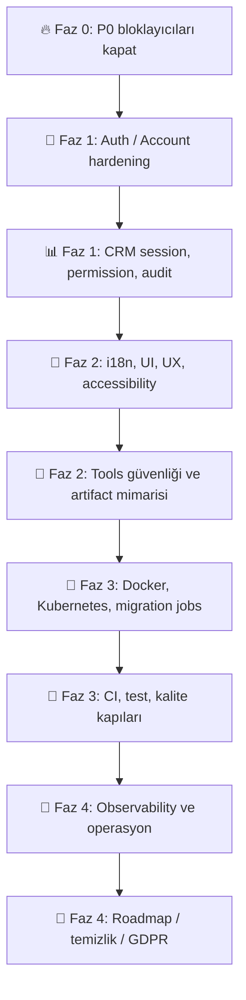

# NetMetric — A’dan Z’ye Eksik, Hata ve İyileştirme Roadmap’i

> **Amaç:** NetMetric projesini production-grade seviyeye taşımak için tespit edilen eksikleri, riskleri ve geliştirme fırsatlarını düzenli bir backlog formatında toplamak.  
> **Kapsam:** `auth-web`, `account-web`, `crm-web`, `tools`, `gateway`, backend servisleri, Kubernetes, CI/CD, observability ve roadmap temizliği.


---

## Yönetici Özeti

Bu rapor, NetMetric’in mevcut yapısında görülen kritik hataları, production risklerini, UX tutarsızlıklarını, güvenlik açıklarını ve mimari iyileştirme alanlarını tek bir takip edilebilir listeye dönüştürür.

En kritik odak noktaları:

- **Auth ve Account tarafında identity bütünlüğü:** aynı email ile duplicate kullanıcı açılması, email confirmation policy, MFA/refresh güvenliği.
- **Cross-app preference senkronizasyonu:** account-web’de değişen theme/locale bilgilerinin crm-web ve diğer uygulamalara deterministik taşınması.
- **CRM güvenlik modeli:** token presence yerine gerçek session/profile/permission doğrulaması.
- **Production deployment güvenilirliği:** Dockerfile path’leri, Kubernetes manifestleri, migration job stratejisi ve release gate otomasyonu.
- **Kalite kapıları:** E2E smoke, accessibility, CodeQL, container scan, manifest scan, coverage ve regression testleri.

---

## Öncelik Legend’i

| Öncelik   | Anlam                                                     | Release Etkisi                    |
| --------- | --------------------------------------------------------- | --------------------------------- |
| 🔥 **P0** | Bloklayıcı / güvenlik / veri bütünlüğü / production riski | Kapatılmadan release önerilmez    |
| 🔴 **P1** | Yüksek öncelik / güvenlik, mimari veya kritik UX          | İlk hardening fazında kapatılmalı |
| 🟠 **P2** | Orta öncelik / kalite, bakım, tutarlılık                  | Sprint planına alınmalı           |
| ⚪ **P3** | Temizlik / roadmap netleştirme                            | Ürünleşme sürecinde kapatılmalı   |

---

## Kategori Özeti

| Kategori                                                               | Bulgu | Varsayılan Öncelik | Faz                                     |
| ---------------------------------------------------------------------- | ----: | ------------------ | --------------------------------------- |
| 🔥 [P0 / Önce bunlar düzeltilmeli](#p0--önce-bunlar-düzeltilmeli)      |    15 | `P0`               | Faz 0 — Bloklayıcılar                   |
| 🔐 [Auth / Account tarafı](#auth--account-tarafı)                      |    10 | `P1`               | Faz 1 — Kimlik ve hesap sağlamlaştırma  |
| 📊 [CRM tarafı](#crm-tarafı)                                           |    13 | `P1`               | Faz 1 — CRM güvenlik ve UX sertleştirme |
| 🎨 [i18n / UI / UX](#i18n--ui--ux)                                     |     7 | `P2`               | Faz 2 — Deneyim kalitesi                |
| 🧰 [Tools servisi](#tools-servisi)                                     |     6 | `P1`               | Faz 2 — Tools production hardening      |
| 🚢 [Docker / Kubernetes / Deployment](#docker--kubernetes--deployment) |    12 | `P1`               | Faz 3 — Deploy edilebilirlik            |
| 🧪 [CI / Test / Kalite](#ci--test--kalite)                             |    11 | `P1/P2`            | Faz 3 — Kalite kapıları                 |
| 📡 [Observability / Operasyon](#observability--operasyon)              |     6 | `P2`               | Faz 4 — Operasyonel görünürlük          |
| 🧭 [Roadmap / Temizlik](#roadmap--temizlik)                            |    10 | `P2/P3`            | Faz 4 — Ürünleşme ve temizlik           |

---

## Önerilen Faz Planı



---

## Hızlı Release Gate Checklist

- [ ] P0 maddeleri kapatıldı ve regression testleri eklendi.
- [ ] Aynı email ile ikinci kayıt denemesi deterministik olarak engelleniyor.
- [ ] Theme/locale cookie stratejisi tüm subdomain’lerde çalışıyor.
- [ ] CRM protected alanları merkezi auth guard ile korunuyor.
- [ ] Production CORS, return URL ve cookie domain allowlist’leri gerçek domainlerle sınırlı.
- [ ] Dockerfile path’leri güncel monorepo yapısıyla uyumlu.
- [ ] Kubernetes readiness, port, secret ve migration job akışları doğrulandı.
- [ ] E2E smoke: register → email confirm → login → account preferences → crm-web sync → logout.
- [ ] CI’da SAST, image scan, manifest scan ve coverage gate çalışıyor.
- [ ] Observability’de correlation id, audit log ve queue lag metrikleri izleniyor.

---

# Detaylı Backlog

## 🔥 P0 / Önce bunlar düzeltilmeli

> **Faz:** Faz 0 — Bloklayıcılar  
> **Varsayılan öncelik:** `P0`  
> **Odak:** Release/production öncesi mutlaka kapatılması gereken kritik kırılımlar.

| Kod     | Durum         | Başlık                                                                                    |
| ------- | ------------- | ----------------------------------------------------------------------------------------- |
| `P0-01` | ✅ Tamamlandı | Account/Preferences kısmında değiştirilen Theme, crm-web’de etkili olmuyor.               |
| `P0-02` | ✅ Tamamlandı | auth-web’de aynı email ile birden fazla hesap açılıyor.                                   |
| `P0-03` | ✅ Tamamlandı | Theme seçeneklerinde Default / System karmaşası var.                                      |
| `P0-04` | ✅ Tamamlandı | Production’da theme/locale cookie domain eksik kalabilir.                                 |
| `P0-05` | ✅ Tamamlandı | CRM tarafında auth kontrolü token varlığına çok fazla güveniyor.                          |
| `P0-06` | ✅ Tamamlandı | CRM’de auth guard layout seviyesinde merkezileştirilmeli.                                 |
| `P0-07` | ✅ Tamamlandı | CRM menüleri ve butonları kullanıcı yetkisine göre gizlenmiyor/devre dışı kalmıyor.       |
| `P0-08` | ✅ Tamamlandı | CRM’de contract_pending modüller kullanıcıya aktifmiş gibi görünebilir.                   |
| `P0-09` | ✅ Tamamlandı | CRM Shell’de Global Search ve Quick Create görsel olarak var ama işlevsiz görünüyor.      |
| `P0-10` | ✅ Tamamlandı | Production CORS ayarları mevcut subdomain planıyla uyumsuz görünüyor.                     |
| `P0-11` | ✅ Tamamlandı | Gateway production/development Auth route davranışı tutarsız.                             |
| `P0-12` | ✅ Tamamlandı | Gateway’de Tools API route’u net görünmüyor.                                              |
| `P0-13` | ✅ Tamamlandı | Register sonrası aynı email duplicate kayıtlarını temizleyecek migration/merge planı yok. |
| `P0-14` | ✅ Tamamlandı | Auth return URL/origin allowlist production için sıkılaştırılmalı.                        |
| `P0-15` | ✅ Tamamlandı | Email confirmation policy production’da zorunlu olmalı.                                   |

### 🔥 P0 · `P0-01` — Account/Preferences kısmında değiştirilen Theme, crm-web’de etkili olmuyor.

**Not / Beklenen düzeltme:**  
Sebep büyük ihtimalle şu: account-web cookie’ye netmetric-theme yazıyor ama crm-web tarafındaki ThemeProvider önce localStorage.netmetric-theme değerini baz alıyor. Eski localStorage değeri cookie’yi eziyor. Theme için cookie source-of-truth yapılmalı ya da localStorage/cookie senkronizasyonu netleştirilmeli.

**Kapanış kriteri:**

- [x] Kod/config düzeltmesi yapıldı.
- [x] En az bir regression/smoke test ile korundu.
- [x] Production/staging etkisi dokümante edildi.

---

### 🔥 P0 · `P0-02` — auth-web’de aynı email ile birden fazla hesap açılıyor.

**Not / Beklenen düzeltme:**  
Register flow her kayıt işleminde yeni Tenant oluşturuyor. Unique index ise global değil, TenantId + NormalizedEmail şeklinde. Bu yüzden aynı email farklı tenant altında tekrar kayıt olabiliyor. NormalizedEmail global unique yapılmalı veya “tek kullanıcı + çok workspace/tenant membership” modeline geçilmeli.

**Kapanış kriteri:**

- [x] Kod/config düzeltmesi yapıldı.
- [x] En az bir regression/smoke test ile korundu.
- [x] Production/staging etkisi dokümante edildi.

---

### 🔥 P0 · `P0-03` — Theme seçeneklerinde Default / System karmaşası var.

**Not / Beklenen düzeltme:**  
Backend tarafında System, Default, Light, Dark var; frontend resolver ise sadece light, dark, system bekliyor. Default değeri sessizce system gibi davranabilir. Tek bir sözleşmeye indirilmeli.

**Kapanış kriteri:**

- [x] Kod/config düzeltmesi yapıldı.
- [x] En az bir regression/smoke test ile korundu.
- [x] Production/staging etkisi dokümante edildi.

---

### 🔥 P0 · `P0-04` — Production’da theme/locale cookie domain eksik kalabilir.

**Not / Beklenen düzeltme:**  
Frontend .env.example cookie domain gerektiğini söylüyor ama Kubernetes configmap/build arg tarafında NEXT_PUBLIC_NETMETRIC_COOKIE_DOMAIN net görünmüyor. account.netmetric.net üzerinde yazılan cookie, crm.netmetric.net tarafına taşınmayabilir.

**Kapanış kriteri:**

- [x] Kod/config düzeltmesi yapıldı.
- [x] En az bir regression/smoke test ile korundu.
- [x] Production/staging etkisi dokümante edildi.

---

### 🔥 P0 · `P0-05` — CRM tarafında auth kontrolü token varlığına çok fazla güveniyor.

**Not / Beklenen düzeltme:**  
require-crm-session içinde token presence kontrolü var; gerçek session/permission/profile doğrulaması sınırlı. CRM protected alanları için /me, session introspection veya Account/Auth doğrulaması zorunlu hale getirilmeli.

**Kapanış kriteri:**

- [x] Kod/config düzeltmesi yapıldı.
- [x] En az bir regression/smoke test ile korundu.
- [x] Production/staging etkisi dokümante edildi.

---

### 🔥 P0 · `P0-06` — CRM’de auth guard layout seviyesinde merkezileştirilmeli.

**Not / Beklenen düzeltme:**  
Bazı sayfalar data fonksiyonları üzerinden auth’a gidiyor ama bu yaklaşım unutulabilir. CRM protected route/layout seviyesinde tek merkezden session kontrolü yapılmalı.

**Kapanış kriteri:**

- [x] Kod/config düzeltmesi yapıldı.
- [x] En az bir regression/smoke test ile korundu.
- [x] Production/staging etkisi dokümante edildi.

---

### 🔥 P0 · `P0-07` — CRM menüleri ve butonları kullanıcı yetkisine göre gizlenmiyor/devre dışı kalmıyor.

**Not / Beklenen düzeltme:**  
Backend policy varsa bile frontend create/edit/delete aksiyonları permission’a göre gösterilmeli. Aksi halde kullanıcı 403 alana kadar hatalı UX görüyor.

**Kapanış kriteri:**

- [x] Kod/config düzeltmesi yapıldı.
- [x] En az bir regression/smoke test ile korundu.
- [x] Production/staging etkisi dokümante edildi.

---

### 🔥 P0 · `P0-08` — CRM’de contract_pending modüller kullanıcıya aktifmiş gibi görünebilir.

**Not / Beklenen düzeltme:**  
Module registry’de birçok modül contract_pending olmasına rağmen route/menu bilgileri var. Bunlar ya gerçek endpointlerle tamamlanmalı ya da “yakında”/disabled olarak gösterilmeli.

**Kapanış kriteri:**

- [x] Kod/config düzeltmesi yapıldı.
- [x] En az bir regression/smoke test ile korundu.
- [x] Production/staging etkisi dokümante edildi.

---

### 🔥 P0 · `P0-09` — CRM Shell’de Global Search ve Quick Create görsel olarak var ama işlevsiz görünüyor.

**Not / Beklenen düzeltme:**  
Arama, command palette veya quick-create akışı bağlanmalı; hazır değilse butonlar disabled + açıklamalı olmalı.

**Kapanış kriteri:**

- [x] Kod/config düzeltmesi yapıldı.
- [x] En az bir regression/smoke test ile korundu.
- [x] Production/staging etkisi dokümante edildi.

---

### 🔥 P0 · `P0-10` — Production CORS ayarları mevcut subdomain planıyla uyumsuz görünüyor.

**Not / Beklenen düzeltme:**  
Auth/Gateway production config’lerinde https://app.netmetric.net var; fakat proje domainleri auth.netmetric.net, account.netmetric.net, crm.netmetric.net, tools.netmetric.net, netmetric.net. Tüm gerçek origin’ler explicit allowlist’e alınmalı.

**Kapanış kriteri:**

- [x] Kod/config düzeltmesi yapıldı.
- [x] En az bir regression/smoke test ile korundu.
- [x] Production/staging etkisi dokümante edildi.

---

### 🔥 P0 · `P0-11` — Gateway production/development Auth route davranışı tutarsız.

**Not / Beklenen düzeltme:**  
Development’ta Auth route için tenant forwarding kapalı, production’da açık görünüyor. Register/login gibi anonymous endpointlerde tenant forwarding zorunluluğu sorun çıkarabilir. Auth route sözleşmesi netleştirilmeli.

**Kapanış kriteri:**

- [x] Kod/config düzeltmesi yapıldı.
- [x] En az bir regression/smoke test ile korundu.
- [x] Production/staging etkisi dokümante edildi.

---

### 🔥 P0 · `P0-12` — Gateway’de Tools API route’u net görünmüyor.

**Not / Beklenen düzeltme:**  
tools-web doğrudan Tools API’ye mi gidecek, yoksa api.netmetric.net gateway üzerinden mi? Bu karar netleştirilmeli ve config buna göre düzenlenmeli.

**Kapanış kriteri:**

- [x] Kod/config düzeltmesi yapıldı.
- [x] En az bir regression/smoke test ile korundu.
- [x] Production/staging etkisi dokümante edildi.

---

### 🔥 P0 · `P0-13` — Register sonrası aynı email duplicate kayıtlarını temizleyecek migration/merge planı yok.

**Not / Beklenen düzeltme:**  
Sadece unique index eklemek yetmez. Mevcut duplicate user/tenant kayıtları için merge, disable veya migration stratejisi hazırlanmalı.

**Kapanış kriteri:**

- [x] Kod/config düzeltmesi yapıldı.
- [x] En az bir regression/smoke test ile korundu.
- [x] Production/staging etkisi dokümante edildi.

---

### 🔥 P0 · `P0-14` — Auth return URL/origin allowlist production için sıkılaştırılmalı.

**Not / Beklenen düzeltme:**  
.env.example local origin’ler içeriyor. Production’da redirect/open-redirect riskine karşı sadece gerçek domainler kabul edilmeli.

**Kapanış kriteri:**

- [x] Kod/config düzeltmesi yapıldı.
- [x] En az bir regression/smoke test ile korundu.
- [x] Production/staging etkisi dokümante edildi.

---

### 🔥 P0 · `P0-15` — Email confirmation policy production’da zorunlu olmalı.

**Not / Beklenen düzeltme:**  
Kayıt sonrası confirmed olmayan kullanıcının login/session alma davranışı production’da kesin şekilde kapatılmalı.

**Kapanış kriteri:**

- [x] Kod/config düzeltmesi yapıldı.
- [x] En az bir regression/smoke test ile korundu.
- [x] Production/staging etkisi dokümante edildi.

---

## 🔐 Auth / Account tarafı

> **Faz:** Faz 1 — Kimlik ve hesap sağlamlaştırma  
> **Varsayılan öncelik:** `P1`  
> **Odak:** Identity, tenant/workspace modeli, session, media ve notification entegrasyonu.

| Kod     | Durum         | Başlık                                                                                                                  |
| ------- | ------------- | ----------------------------------------------------------------------------------------------------------------------- |
| `P1-16` | ✅ Tamamlandı | Register flow user ve tenant oluşturmayı fazla birbirine bağlı yapıyor.                                                 |
| `P1-17` | ✅ Tamamlandı | RegisterCommandValidator email uniqueness kontrolü yapmıyor.                                                            |
| `P1-18` | ✅ Tamamlandı | Login, forgot password, reset password, email confirmation endpointleri rate-limit açısından tekrar gözden geçirilmeli. |
| `P1-19` | ✅ Tamamlandı | MFA açık kullanıcıda refresh token davranışı testlerle korunmalı.                                                       |
| `P1-20` | ✅ Tamamlandı | Account Preferences optimistic concurrency UX eksik kalabilir.                                                          |
| `P1-21` | ✅ Tamamlandı | Account security notification publisher no-op/stub gibi duruyor.                                                        |
| `P1-22` | ✅ Tamamlandı | Account integration event publisher gerçek publish etmiyor olabilir.                                                    |
| `P1-23` | ✅ Tamamlandı | Avatar/media upload tarafında orphan cleanup eklenmeli.                                                                 |
| `P1-24` | ✅ Tamamlandı | Avatar/media upload için magic-byte validation ve güvenlik taraması eklenmeli.                                          |
| `P1-25` | ✅ Tamamlandı | Account session ekranı gerçek zamanlı güncellenmeli.                                                                    |

### 🔴 P1 · `P1-16` — Register flow user ve tenant oluşturmayı fazla birbirine bağlı yapıyor.

**Not / Beklenen düzeltme:**  
SaaS için daha sağlam model: önce global user identity, sonra workspace/tenant membership. Böylece aynı email ile birden fazla workspace yönetilebilir ama duplicate identity oluşmaz.

**Kapanış kriteri:**

- [x] Kod/config düzeltmesi yapıldı.
- [x] En az bir regression/smoke test ile korundu.
- [x] Production/staging etkisi dokümante edildi.

---

### 🔴 P1 · `P1-17` — RegisterCommandValidator email uniqueness kontrolü yapmıyor.

**Not / Beklenen düzeltme:**  
Validator veya handler seviyesinde normalized email için ön kontrol eklenmeli. Race condition için ayrıca database unique constraint ve DbUpdateException yakalama şart.

**Kapanış kriteri:**

- [x] Kod/config düzeltmesi yapıldı.
- [x] En az bir regression/smoke test ile korundu.
- [x] Production/staging etkisi dokümante edildi.

---

### 🔴 P1 · `P1-18` — Login, forgot password, reset password, email confirmation endpointleri rate-limit açısından tekrar gözden geçirilmeli.

**Not / Beklenen düzeltme:**  
Register’da rate-limit var; tüm hassas auth endpointleri için IP + email + tenant bazlı limit olmalı.

**Kapanış kriteri:**

- [x] Kod/config düzeltmesi yapıldı.
- [x] En az bir regression/smoke test ile korundu.
- [x] Production/staging etkisi dokümante edildi.

---

### 🔴 P1 · `P1-19` — MFA açık kullanıcıda refresh token davranışı testlerle korunmalı.

**Not / Beklenen düzeltme:**  
MFA sonradan aktif edilirse eski refresh token/session davranışı güvenli kalmalı. Bu alan için regression testleri artırılmalı.

**Kapanış kriteri:**

- [x] Kod/config düzeltmesi yapıldı.
- [x] En az bir regression/smoke test ile korundu.
- [x] Production/staging etkisi dokümante edildi.

---

### 🔴 P1 · `P1-20` — Account Preferences optimistic concurrency UX eksik kalabilir.

**Not / Beklenen düzeltme:**  
Version/concurrency desteği var ama kullanıcıya “başka sekmede değişiklik yapıldı” gibi düzgün hata ekranı/toast dönmeli.

**Kapanış kriteri:**

- [x] Kod/config düzeltmesi yapıldı.
- [x] En az bir regression/smoke test ile korundu.
- [x] Production/staging etkisi dokümante edildi.

---

### 🔴 P1 · `P1-21` — Account security notification publisher no-op/stub gibi duruyor.

**Not / Beklenen düzeltme:**  
Şifre değişimi, MFA değişimi, oturum kapatma, email değişimi gibi güvenlik olayları gerçek Notification/Outbox akışına bağlanmalı.

**Kapanış kriteri:**

- [x] Kod/config düzeltmesi yapıldı.
- [x] En az bir regression/smoke test ile korundu.
- [x] Production/staging etkisi dokümante edildi.

---

### 🔴 P1 · `P1-22` — Account integration event publisher gerçek publish etmiyor olabilir.

**Not / Beklenen düzeltme:**  
Task.CompletedTask tarzı stub publisher varsa Account değişiklikleri diğer servislerle senkron kalmaz. Outbox/event bus gerçek hale getirilmeli.

**Kapanış kriteri:**

- [x] Kod/config düzeltmesi yapıldı.
- [x] En az bir regression/smoke test ile korundu.
- [x] Production/staging etkisi dokümante edildi.

---

### 🔴 P1 · `P1-23` — Avatar/media upload tarafında orphan cleanup eklenmeli.

**Not / Beklenen düzeltme:**  
Kullanıcı avatar değiştirince eski dosya temizlenmeli, silinmiş user/profile medya dosyaları periyodik job ile temizlenmeli.

**Kapanış kriteri:**

- [x] Kod/config düzeltmesi yapıldı.
- [x] En az bir regression/smoke test ile korundu.
- [x] Production/staging etkisi dokümante edildi.

---

### 🔴 P1 · `P1-24` — Avatar/media upload için magic-byte validation ve güvenlik taraması eklenmeli.

**Not / Beklenen düzeltme:**  
Sadece content-type/extension güvenli değil. Dosyanın gerçek imzası, boyutu, image decode başarısı ve metadata temizliği doğrulanmalı.

**Kapanış kriteri:**

- [x] Kod/config düzeltmesi yapıldı.
- [x] En az bir regression/smoke test ile korundu.
- [x] Production/staging etkisi dokümante edildi.

---

### 🔴 P1 · `P1-25` — Account session ekranı gerçek zamanlı güncellenmeli.

**Not / Beklenen düzeltme:**  
Session listesi, revoke sonrası anında refresh edilmeli; current session ayrı işaretlenmeli; son aktivite UTC/user timezone ile düzgün gösterilmeli.

**Kapanış kriteri:**

- [x] Kod/config düzeltmesi yapıldı.
- [x] En az bir regression/smoke test ile korundu.
- [x] Production/staging etkisi dokümante edildi.

---

## 📊 CRM tarafı

> **Faz:** Faz 1 — CRM güvenlik ve UX sertleştirme  
> **Varsayılan öncelik:** `P1`  
> **Odak:** CRM session, permission, audit, import/export ve public endpoint güvenliği.

| Kod     | Durum         | Başlık                                                                 |
| ------- | ------------- | ---------------------------------------------------------------------- |
| `P1-26` | ✅ Tamamlandı | CRM session/profile endpointleri tam bağlanmalı.                       |
| `P1-27` | ✅ Tamamlandı | CRM backend policy’leri frontend capability map’e çevrilmeli.          |
| `P1-28` | ✅ Tamamlandı | CRM dashboard verilerinde hardcoded fallback metinler var.             |
| `P1-29` | ✅ Tamamlandı | Lead/Customer duplicate detection UI tamamlanmalı.                     |
| `P1-30` | ✅ Tamamlandı | CRM import/export akışları production-grade yapılmalı.                 |
| `P1-31` | ✅ Tamamlandı | CRM mutation işlemlerine audit log standardı getirilmeli.              |
| `P1-32` | ✅ Tamamlandı | CRM public capture endpointleri abuse koruması istiyor.                |
| `P1-33` | ✅ Tamamlandı | Marketing unsubscribe/consent endpointleri signed token ile çalışmalı. |
| `P1-34` | ✅ Tamamlandı | Integration webhook endpointlerinde replay protection güçlendirilmeli. |
| `P1-35` | ✅ Tamamlandı | Mock integration provider production’da kapalı olmalı.                 |
| `P1-36` | ✅ Tamamlandı | CRM modül registry ile backend endpoint durumu eşleştirilmeli.         |
| `P1-37` | ✅ Tamamlandı | Date/time formatları user preference üzerinden global uygulanmalı.     |
| `P1-38` | ✅ Tamamlandı | CRM error handling standardize edilmeli.                               |

### 🔴 P1 · `P1-26` — CRM session/profile endpointleri tam bağlanmalı.

**Not / Beklenen düzeltme:**  
CRM UI sadece token değil, kullanıcı profili, tenant, role, permission, plan ve account status bilgisiyle açılmalı.

**Kapanış kriteri:**

- [x] Kod/config düzeltmesi yapıldı.
- [x] En az bir regression/smoke test ile korundu.
- [x] Production/staging etkisi dokümante edildi.

---

### 🔴 P1 · `P1-27` — CRM backend policy’leri frontend capability map’e çevrilmeli.

**Not / Beklenen düzeltme:**  
Örneğin canCreateLead, canEditDeal, canExportCustomer gibi UI seviyesinde kullanılacak yetki sözleşmesi oluşturulmalı.

**Kapanış kriteri:**

- [x] Kod/config düzeltmesi yapıldı.
- [x] En az bir regression/smoke test ile korundu.
- [x] Production/staging etkisi dokümante edildi.

---

### 🔴 P1 · `P1-28` — CRM dashboard verilerinde hardcoded fallback metinler var.

**Not / Beklenen düzeltme:**  
Örneğin “No contact info” gibi metinler i18n dictionary’ye taşınmalı.

**Kapanış kriteri:**

- [x] Kod/config düzeltmesi yapıldı.
- [x] En az bir regression/smoke test ile korundu.
- [x] Production/staging etkisi dokümante edildi.

---

### 🔴 P1 · `P1-29` — Lead/Customer duplicate detection UI tamamlanmalı.

**Not / Beklenen düzeltme:**  
Backend’de duplicate servisleri var gibi duruyor ama kullanıcıya merge önerisi, uyarı ve duplicate çözme ekranı eklenmeli.

**Kapanış kriteri:**

- [x] Kod/config düzeltmesi yapıldı.
- [x] En az bir regression/smoke test ile korundu.
- [x] Production/staging etkisi dokümante edildi.

---

### 🔴 P1 · `P1-30` — CRM import/export akışları production-grade yapılmalı.

**Not / Beklenen düzeltme:**  
CSV/Excel import için schema validation, preview, dry-run, hata raporu, duplicate kontrolü ve rollback desteği eklenmeli.

**Kapanış kriteri:**

- [x] Kod/config düzeltmesi yapıldı.
- [x] En az bir regression/smoke test ile korundu.
- [x] Production/staging etkisi dokümante edildi.

---

### 🔴 P1 · `P1-31` — CRM mutation işlemlerine audit log standardı getirilmeli.

**Not / Beklenen düzeltme:**  
Create/update/delete/export/import gibi tüm kritik işlemler correlation id, user id, tenant id ve before/after özetleriyle loglanmalı.

**Kapanış kriteri:**

- [x] Kod/config düzeltmesi yapıldı.
- [x] En az bir regression/smoke test ile korundu.
- [x] Production/staging etkisi dokümante edildi.

---

### 🔴 P1 · `P1-32` — CRM public capture endpointleri abuse koruması istiyor.

**Not / Beklenen düzeltme:**  
Lead capture anonymous ise captcha, rate-limit, tenant/domain allowlist, payload size limit ve spam kontrolü eklenmeli.

**Kapanış kriteri:**

- [x] Kod/config düzeltmesi yapıldı.
- [x] En az bir regression/smoke test ile korundu.
- [x] Production/staging etkisi dokümante edildi.

---

### 🔴 P1 · `P1-33` — Marketing unsubscribe/consent endpointleri signed token ile çalışmalı.

**Not / Beklenen düzeltme:**  
Anonymous endpointlerde sadece id/email ile işlem yapılmamalı. İmzalı, süreli, tek kullanımlık token tercih edilmeli.

**Kapanış kriteri:**

- [x] Kod/config düzeltmesi yapıldı.
- [x] En az bir regression/smoke test ile korundu.
- [x] Production/staging etkisi dokümante edildi.

---

### 🔴 P1 · `P1-34` — Integration webhook endpointlerinde replay protection güçlendirilmeli.

**Not / Beklenen düzeltme:**  
Signature validation yanında timestamp tolerance, nonce/idempotency, body size limit ve provider bazlı rate-limit eklenmeli.

**Kapanış kriteri:**

- [x] Kod/config düzeltmesi yapıldı.
- [x] En az bir regression/smoke test ile korundu.
- [x] Production/staging etkisi dokümante edildi.

---

### 🔴 P1 · `P1-35` — Mock integration provider production’da kapalı olmalı.

**Not / Beklenen düzeltme:**  
Mock webhook veya mock provider production ortamında explicit olarak disabled olmalı.

**Kapanış kriteri:**

- [x] Kod/config düzeltmesi yapıldı.
- [x] En az bir regression/smoke test ile korundu.
- [x] Production/staging etkisi dokümante edildi.

---

### 🔴 P1 · `P1-36` — CRM modül registry ile backend endpoint durumu eşleştirilmeli.

**Not / Beklenen düzeltme:**  
Frontend “source_visible” diyor ama modül gerçekten production-ready değilse kullanıcıya açık gösterilmemeli.

**Kapanış kriteri:**

- [x] Kod/config düzeltmesi yapıldı.
- [x] En az bir regression/smoke test ile korundu.
- [x] Production/staging etkisi dokümante edildi.

---

### 🔴 P1 · `P1-37` — Date/time formatları user preference üzerinden global uygulanmalı.

**Not / Beklenen düzeltme:**  
Account Preferences’ta timezone/date format varsa CRM tabloları, dashboard ve detay sayfaları bunu tek helper üzerinden kullanmalı.

**Kapanış kriteri:**

- [x] Kod/config düzeltmesi yapıldı.
- [x] En az bir regression/smoke test ile korundu.
- [x] Production/staging etkisi dokümante edildi.

---

### 🔴 P1 · `P1-38` — CRM error handling standardize edilmeli.

**Not / Beklenen düzeltme:**  
401 redirect, 403 access denied, 404 not found, 409 concurrency conflict, 422 validation error ve 500 fallback için ortak UI pattern olmalı.

**Kapanış kriteri:**

- [x] Kod/config düzeltmesi yapıldı.
- [x] En az bir regression/smoke test ile korundu.
- [x] Production/staging etkisi dokümante edildi.

---

## 🎨 i18n / UI / UX

> **Faz:** Faz 2 — Deneyim kalitesi  
> **Varsayılan öncelik:** `P2`  
> **Odak:** Çeviri kalitesi, validasyon mesajları, accessibility ve ortak UI standardı.

| Kod     | Durum   | Başlık                                                                     |
| ------- | ------- | -------------------------------------------------------------------------- |
| `P2-39` | ⬜ Açık | i18n key sayısı eşit ama çeviri kalitesi eksik.                            |
| `P2-40` | ⬜ Açık | Türkçe dictionary içinde hâlâ İngilizce kalan alanlar var.                 |
| `P2-41` | ⬜ Açık | Form validation mesajları tek yerden yönetilmeli.                          |
| `P2-42` | ⬜ Açık | Toast/action result metinleri tamamen i18n olmalı.                         |
| `P2-43` | ⬜ Açık | Accessibility smoke test eklenmeli.                                        |
| `P2-44` | ⬜ Açık | Dark mode renkleri shadcn tokenlarıyla birebir sabitlenmeli.               |
| `P2-45` | ⬜ Açık | Frontend shell/loading/error ekranları app’ler arasında ortaklaştırılmalı. |

### 🟠 P2 · `P2-39` — i18n key sayısı eşit ama çeviri kalitesi eksik.

**Not / Beklenen düzeltme:**  
EN/TR dictionary’lerde “Title”, “Description”, “Label”, “Placeholder” gibi generic değerler var. Bunlar gerçek metinlerle değiştirilmeli.

**Kapanış kriteri:**

- [ ] Kod/config düzeltmesi yapıldı.
- [ ] En az bir regression/smoke test ile korundu.
- [ ] Production/staging etkisi dokümante edildi.

Kapanmadı / Kısmi Not: i18n kalite raporlama scripti eklendi ve belirli account/tools metinleri iyileştirildi, ancak tüm EN/TR generic metin seti henüz tamamen temizlenmedi.

---

### 🟠 P2 · `P2-40` — Türkçe dictionary içinde hâlâ İngilizce kalan alanlar var.

**Not / Beklenen düzeltme:**  
Özellikle CRM lead/create/description ve bazı scaffold/tool history alanları temizlenmeli.

**Kapanış kriteri:**

- [ ] Kod/config düzeltmesi yapıldı.
- [ ] En az bir regression/smoke test ile korundu.
- [ ] Production/staging etkisi dokümante edildi.

Kapanmadı / Kısmi Not: TR kalite kontrol raporu eklendi ve kritik bazı anahtarlar çevrildi; yine de sözlükte çok sayıda İngilizce kalıntı bulunduğu için madde açık bırakıldı.

---

### 🟠 P2 · `P2-41` — Form validation mesajları tek yerden yönetilmeli.

**Not / Beklenen düzeltme:**  
Zod/client validation, server action errors ve API validation messages aynı i18n key sistemine bağlanmalı.

**Kapanış kriteri:**

- [ ] Kod/config düzeltmesi yapıldı.
- [ ] En az bir regression/smoke test ile korundu.
- [ ] Production/staging etkisi dokümante edildi.

Kapanmadı / Kısmi Not: Account mutation error mapping i18n anahtarlarına taşındı; ancak auth/account/crm/tools genelinde tek ortak validation sözleşmesi tüm formlar için henüz tamamlanmadı.

---

### 🟠 P2 · `P2-42` — Toast/action result metinleri tamamen i18n olmalı.

**Not / Beklenen düzeltme:**  
Başarı, hata, loading, empty state, retry gibi tüm kısa mesajlar dictionary’den gelmeli.

**Kapanış kriteri:**

- [ ] Kod/config düzeltmesi yapıldı.
- [ ] En az bir regression/smoke test ile korundu.
- [ ] Production/staging etkisi dokümante edildi.

Kapanmadı / Kısmi Not: Tools history download API hata mesajları ve account mutation fallback metinleri i18n’e taşındı; ancak tüm uygulamalardaki action/toast sonuçları için tam hardcoded temizliği henüz tamamlanmadı.

---

### 🟠 P2 · `P2-43` — Accessibility smoke test eklenmeli.

**Not / Beklenen düzeltme:**  
Keyboard navigation, focus-visible, aria-label, dialog focus trap, color contrast için Playwright + axe tarzı test eklenmeli.

**Kapanış kriteri:**

- [ ] Kod/config düzeltmesi yapıldı.
- [ ] En az bir regression/smoke test ile korundu.
- [ ] Production/staging etkisi dokümante edildi.

---

### 🟠 P2 · `P2-44` — Dark mode renkleri shadcn tokenlarıyla birebir sabitlenmeli.

**Not / Beklenen düzeltme:**  
globals.css, theme.css, tokens.css arasında token çakışması olmamalı. App’ler aynı CSS değişkenlerini tüketmeli.

**Kapanış kriteri:**

- [ ] Kod/config düzeltmesi yapıldı.
- [ ] En az bir regression/smoke test ile korundu.
- [ ] Production/staging etkisi dokümante edildi.

---

### 🟠 P2 · `P2-45` — Frontend shell/loading/error ekranları app’ler arasında ortaklaştırılmalı.

**Not / Beklenen düzeltme:**  
auth/account/crm/tools/public aynı tasarım dilini kullanmalı; empty/error/loading sayfaları shared UI package’a alınmalı.

**Kapanış kriteri:**

- [ ] Kod/config düzeltmesi yapıldı.
- [ ] En az bir regression/smoke test ile korundu.
- [ ] Production/staging etkisi dokümante edildi.

---

## 🧰 Tools servisi

> **Faz:** Faz 2 — Tools production hardening  
> **Varsayılan öncelik:** `P1`  
> **Odak:** Upload güvenliği, artifact storage, retention ve async job modeli.

| Kod     | Durum   | Başlık                                                            |
| ------- | ------- | ----------------------------------------------------------------- |
| `P1-46` | ⬜ Açık | Tools upload güvenliği artırılmalı.                               |
| `P1-47` | ⬜ Açık | Tools artifact storage local filesystem üzerinde kalmamalı.       |
| `P1-48` | ⬜ Açık | Tools artifact download MIME type kaybı olabilir.                 |
| `P1-49` | ⬜ Açık | Tools history/artifact retention policy eklenmeli.                |
| `P1-50` | ⬜ Açık | ToolsCatalogController public/private sözleşmesi explicit olmalı. |
| `P1-51` | ⬜ Açık | Tools execution için async job modeli eklenebilir.                |

### 🔴 P1 · `P1-46` — Tools upload güvenliği artırılmalı.

**Not / Beklenen düzeltme:**  
MIME type spoofing’e karşı magic-byte validation, image decode validation, antivirus/malware scanning ve zip-bomb benzeri limitler eklenmeli.

**Kapanış kriteri:**

- [ ] Kod/config düzeltmesi yapıldı.
- [ ] En az bir regression/smoke test ile korundu.
- [ ] Production/staging etkisi dokümante edildi.

---

### 🔴 P1 · `P1-47` — Tools artifact storage local filesystem üzerinde kalmamalı.

**Not / Beklenen düzeltme:**  
Kubernetes’te 2 replica varsa bir pod’da üretilen dosya diğer pod’dan indirilemeyebilir. S3/R2/MinIO/PV gibi shared storage kullanılmalı.

**Kapanış kriteri:**

- [ ] Kod/config düzeltmesi yapıldı.
- [ ] En az bir regression/smoke test ile korundu.
- [ ] Production/staging etkisi dokümante edildi.

---

### 🔴 P1 · `P1-48` — Tools artifact download MIME type kaybı olabilir.

**Not / Beklenen düzeltme:**  
Local storage application/octet-stream döndürüyorsa PNG/JPG/PDF gibi gerçek MIME korunmalı.

**Kapanış kriteri:**

- [ ] Kod/config düzeltmesi yapıldı.
- [ ] En az bir regression/smoke test ile korundu.
- [ ] Production/staging etkisi dokümante edildi.

---

### 🔴 P1 · `P1-49` — Tools history/artifact retention policy eklenmeli.

**Not / Beklenen düzeltme:**  
Kullanıcı başına quota, dosya saklama süresi, otomatik temizlik ve soft-delete hard-delete ayrımı yapılmalı.

**Kapanış kriteri:**

- [ ] Kod/config düzeltmesi yapıldı.
- [ ] En az bir regression/smoke test ile korundu.
- [ ] Production/staging etkisi dokümante edildi.

---

### 🔴 P1 · `P1-50` — ToolsCatalogController public/private sözleşmesi explicit olmalı.

**Not / Beklenen düzeltme:**  
Public katalog ise [AllowAnonymous] ve rate-limit eklenmeli; private ise [Authorize] olmalı.

**Kapanış kriteri:**

- [ ] Kod/config düzeltmesi yapıldı.
- [ ] En az bir regression/smoke test ile korundu.
- [ ] Production/staging etkisi dokümante edildi.

---

### 🔴 P1 · `P1-51` — Tools execution için async job modeli eklenebilir.

**Not / Beklenen düzeltme:**  
Büyük PDF/image işlemleri request içinde değil, job queue + progress + result download modeliyle çalışmalı.

**Kapanış kriteri:**

- [ ] Kod/config düzeltmesi yapıldı.
- [ ] En az bir regression/smoke test ile korundu.
- [ ] Production/staging etkisi dokümante edildi.

---

## 🚢 Docker / Kubernetes / Deployment

> **Faz:** Faz 3 — Deploy edilebilirlik  
> **Varsayılan öncelik:** `P1`  
> **Odak:** Container image, Kubernetes manifest, port, migration ve workload güvenliği.

| Kod     | Durum   | Başlık                                                                                                      |
| ------- | ------- | ----------------------------------------------------------------------------------------------------------- |
| `P1-52` | ⬜ Açık | Frontend Dockerfile’ları runtime image içine tüm repo’yu kopyalıyor.                                        |
| `P1-53` | ⬜ Açık | Account API Dockerfile path’leri eski repo yapısına göre kalmış görünüyor.                                  |
| `P1-54` | ⬜ Açık | CRM API Dockerfile path’leri eski repo yapısına göre kalmış görünüyor.                                      |
| `P1-55` | ⬜ Açık | Gateway Dockerfile path’leri eski repo yapısına göre kalmış görünüyor.                                      |
| `P1-56` | ⬜ Açık | Auth API, Account API, CRM API, Gateway ve Notification Worker için image publish workflow eksik görünüyor. |
| `P1-57` | ⬜ Açık | Kubernetes manifestlerinde core backend servisleri eksik görünüyor.                                         |
| `P1-58` | ⬜ Açık | Kubernetes image tag’lerinde REPLACE_WITH_GIT_SHA otomasyonu netleşmeli.                                    |
| `P1-59` | ⬜ Açık | Kubernetes readiness endpointleri fazla yüzeysel.                                                           |
| `P1-60` | ⬜ Açık | Tools API local artifact path için volume yoksa veri kaybolur.                                              |
| `P1-61` | ⬜ Açık | Production Kestrel portları ve Kubernetes targetPort değerleri doğrulanmalı.                                |
| `P1-62` | ⬜ Açık | NetworkPolicy, PodDisruptionBudget ve SecurityContext standartlaştırılmalı.                                 |
| `P1-63` | ⬜ Açık | Migration deployment stratejisi eksik kalmış görünüyor.                                                     |

### 🔴 P1 · `P1-52` — Frontend Dockerfile’ları runtime image içine tüm repo’yu kopyalıyor.

**Not / Beklenen düzeltme:**  
Bu hem image boyutunu büyütür hem source/dev dosyalarını production image’a taşır. Next.js standalone output + prune edilmiş prod deps kullanılmalı.

**Kapanış kriteri:**

- [ ] Kod/config düzeltmesi yapıldı.
- [ ] En az bir regression/smoke test ile korundu.
- [ ] Production/staging etkisi dokümante edildi.

---

### 🔴 P1 · `P1-53` — Account API Dockerfile path’leri eski repo yapısına göre kalmış görünüyor.

**Not / Beklenen düzeltme:**  
src/Services/Account/... gibi yollar mevcut repo yapısıyla uyuşmuyor. Docker build kırılabilir.

**Kapanış kriteri:**

- [ ] Kod/config düzeltmesi yapıldı.
- [ ] En az bir regression/smoke test ile korundu.
- [ ] Production/staging etkisi dokümante edildi.

---

### 🔴 P1 · `P1-54` — CRM API Dockerfile path’leri eski repo yapısına göre kalmış görünüyor.

**Not / Beklenen düzeltme:**  
src/Services/CRM/... path’leri güncel services/crm/src/... yapısına çekilmeli.

**Kapanış kriteri:**

- [ ] Kod/config düzeltmesi yapıldı.
- [ ] En az bir regression/smoke test ile korundu.
- [ ] Production/staging etkisi dokümante edildi.

---

### 🔴 P1 · `P1-55` — Gateway Dockerfile path’leri eski repo yapısına göre kalmış görünüyor.

**Not / Beklenen düzeltme:**  
src/Gateway/... yerine güncel platform/gateway/src/... yapısı kullanılmalı.

**Kapanış kriteri:**

- [ ] Kod/config düzeltmesi yapıldı.
- [ ] En az bir regression/smoke test ile korundu.
- [ ] Production/staging etkisi dokümante edildi.

---

### 🔴 P1 · `P1-56` — Auth API, Account API, CRM API, Gateway ve Notification Worker için image publish workflow eksik görünüyor.

**Not / Beklenen düzeltme:**  
Frontend ve Tools API tarafı var; core backend servisleri için de container publish pipeline tamamlanmalı.

**Kapanış kriteri:**

- [ ] Kod/config düzeltmesi yapıldı.
- [ ] En az bir regression/smoke test ile korundu.
- [ ] Production/staging etkisi dokümante edildi.

---

### 🔴 P1 · `P1-57` — Kubernetes manifestlerinde core backend servisleri eksik görünüyor.

**Not / Beklenen düzeltme:**  
Auth API, Account API, CRM API, Gateway, Notification Worker, migration job ve secret wiring manifestleri tamamlanmalı.

**Kapanış kriteri:**

- [ ] Kod/config düzeltmesi yapıldı.
- [ ] En az bir regression/smoke test ile korundu.
- [ ] Production/staging etkisi dokümante edildi.

---

### 🔴 P1 · `P1-58` — Kubernetes image tag’lerinde REPLACE_WITH_GIT_SHA otomasyonu netleşmeli.

**Not / Beklenen düzeltme:**  
Release pipeline image tag’i otomatik patch’lemeli; manuel placeholder production’a kalmamalı.

**Kapanış kriteri:**

- [ ] Kod/config düzeltmesi yapıldı.
- [ ] En az bir regression/smoke test ile korundu.
- [ ] Production/staging etkisi dokümante edildi.

---

### 🔴 P1 · `P1-59` — Kubernetes readiness endpointleri fazla yüzeysel.

**Not / Beklenen düzeltme:**  
Next app’lerde /health/ready sadece “ready” dönüyorsa API bağlantısı, env config, auth endpoint, required secret varlığı kontrol edilmiyor demektir.

**Kapanış kriteri:**

- [ ] Kod/config düzeltmesi yapıldı.
- [ ] En az bir regression/smoke test ile korundu.
- [ ] Production/staging etkisi dokümante edildi.

---

### 🔴 P1 · `P1-60` — Tools API local artifact path için volume yoksa veri kaybolur.

**Not / Beklenen düzeltme:**  
/var/lib/netmetric/tools-artifacts gibi path’ler pod restart’ında veya replica değişiminde kaybolabilir. PVC/object storage şart.

**Kapanış kriteri:**

- [ ] Kod/config düzeltmesi yapıldı.
- [ ] En az bir regression/smoke test ile korundu.
- [ ] Production/staging etkisi dokümante edildi.

---

### 🔴 P1 · `P1-61` — Production Kestrel portları ve Kubernetes targetPort değerleri doğrulanmalı.

**Not / Beklenen düzeltme:**  
Bazı .NET production config’lerinde https://+:8443, manifestlerde 8080 tarzı hedefler olabilir. Deploy sırasında port uyuşmazlığı çıkabilir.

**Kapanış kriteri:**

- [ ] Kod/config düzeltmesi yapıldı.
- [ ] En az bir regression/smoke test ile korundu.
- [ ] Production/staging etkisi dokümante edildi.

---

### 🔴 P1 · `P1-62` — NetworkPolicy, PodDisruptionBudget ve SecurityContext standartlaştırılmalı.

**Not / Beklenen düzeltme:**  
Tüm servislerde non-root user, read-only root filesystem, dropped capabilities, resource limits, HPA ve PDB kullanılmalı.

**Kapanış kriteri:**

- [ ] Kod/config düzeltmesi yapıldı.
- [ ] En az bir regression/smoke test ile korundu.
- [ ] Production/staging etkisi dokümante edildi.

---

### 🔴 P1 · `P1-63` — Migration deployment stratejisi eksik kalmış görünüyor.

**Not / Beklenen düzeltme:**  
EF migrations production’da app startup’ta değil, migration bundle/job olarak çalışmalı. Her servis için migration job netleşmeli.

**Kapanış kriteri:**

- [ ] Kod/config düzeltmesi yapıldı.
- [ ] En az bir regression/smoke test ile korundu.
- [ ] Production/staging etkisi dokümante edildi.

---

## 🧪 CI / Test / Kalite

> **Faz:** Faz 3 — Kalite kapıları  
> **Varsayılan öncelik:** `P1/P2`  
> **Odak:** Coverage, E2E smoke, SAST, image scan, manifest scan ve dependency automation.

| Kod     | Durum   | Başlık                                                  |
| ------- | ------- | ------------------------------------------------------- |
| `P1-64` | ⬜ Açık | crm-web için test script’i eksik görünüyor.             |
| `P1-65` | ⬜ Açık | public-web ve tools-web için test coverage artırılmalı. |
| `P1-66` | ⬜ Açık | Sonar coverage sadece frontend ağırlıklı kalmamalı.     |
| `P1-67` | ⬜ Açık | Coverage threshold konmalı.                             |
| `P1-68` | ⬜ Açık | Security pipeline’a CodeQL eklenmeli.                   |
| `P1-69` | ⬜ Açık | Container image scanning eklenmeli.                     |
| `P1-70` | ⬜ Açık | Kubernetes manifest scanning eklenmeli.                 |
| `P1-71` | ⬜ Açık | Dependency update otomasyonu eklenmeli.                 |
| `P1-72` | ⬜ Açık | E2E smoke flow eklenmeli.                               |
| `P1-73` | ⬜ Açık | Auth duplicate email regression testi eklenmeli.        |
| `P1-74` | ⬜ Açık | Production config validation CI’da çalışmalı.           |

### 🔴 P1 · `P1-64` — crm-web için test script’i eksik görünüyor.

**Not / Beklenen düzeltme:**  
CRM en kritik UI olmasına rağmen package script tarafında test yok. Vitest/RTL + Playwright smoke eklenmeli.

**Kapanış kriteri:**

- [ ] Kod/config düzeltmesi yapıldı.
- [ ] En az bir regression/smoke test ile korundu.
- [ ] Production/staging etkisi dokümante edildi.

---

### 🔴 P1 · `P1-65` — public-web ve tools-web için test coverage artırılmalı.

**Not / Beklenen düzeltme:**  
Route render, SEO metadata, health endpoint, form action ve temel accessibility testleri eklenmeli.

**Kapanış kriteri:**

- [ ] Kod/config düzeltmesi yapıldı.
- [ ] En az bir regression/smoke test ile korundu.
- [ ] Production/staging etkisi dokümante edildi.

---

### 🔴 P1 · `P1-66` — Sonar coverage sadece frontend ağırlıklı kalmamalı.

**Not / Beklenen düzeltme:**  
.NET tarafı için Coverlet/ReportGenerator/Sonar coverage import eklenmeli.

**Kapanış kriteri:**

- [ ] Kod/config düzeltmesi yapıldı.
- [ ] En az bir regression/smoke test ile korundu.
- [ ] Production/staging etkisi dokümante edildi.

---

### 🔴 P1 · `P1-67` — Coverage threshold konmalı.

**Not / Beklenen düzeltme:**  
Şu an coverage düşükse bile yeni kod için minimum threshold ve “new code coverage” gate’i eklenmeli.

**Kapanış kriteri:**

- [ ] Kod/config düzeltmesi yapıldı.
- [ ] En az bir regression/smoke test ile korundu.
- [ ] Production/staging etkisi dokümante edildi.

---

### 🔴 P1 · `P1-68` — Security pipeline’a CodeQL eklenmeli.

**Not / Beklenen düzeltme:**  
C# ve TypeScript için CodeQL/SAST taraması ayrı workflow olarak çalışmalı.

**Kapanış kriteri:**

- [ ] Kod/config düzeltmesi yapıldı.
- [ ] En az bir regression/smoke test ile korundu.
- [ ] Production/staging etkisi dokümante edildi.

---

### 🔴 P1 · `P1-69` — Container image scanning eklenmeli.

**Not / Beklenen düzeltme:**  
Docker image’lar Trivy/Grype ile taranmalı; critical/high açıklar release’i bloklamalı.

**Kapanış kriteri:**

- [ ] Kod/config düzeltmesi yapıldı.
- [ ] En az bir regression/smoke test ile korundu.
- [ ] Production/staging etkisi dokümante edildi.

---

### 🔴 P1 · `P1-70` — Kubernetes manifest scanning eklenmeli.

**Not / Beklenen düzeltme:**  
kube-score, kube-linter, Checkov veya benzeri araçla deployment güvenliği kontrol edilmeli.

**Kapanış kriteri:**

- [ ] Kod/config düzeltmesi yapıldı.
- [ ] En az bir regression/smoke test ile korundu.
- [ ] Production/staging etkisi dokümante edildi.

---

### 🔴 P1 · `P1-71` — Dependency update otomasyonu eklenmeli.

**Not / Beklenen düzeltme:**  
Renovate veya Dependabot ile NuGet, npm/pnpm, Docker base image güncellemeleri kontrollü açılmalı.

**Kapanış kriteri:**

- [ ] Kod/config düzeltmesi yapıldı.
- [ ] En az bir regression/smoke test ile korundu.
- [ ] Production/staging etkisi dokümante edildi.

---

### 🔴 P1 · `P1-72` — E2E smoke flow eklenmeli.

**Not / Beklenen düzeltme:**  
Register → email confirm → login → account preferences theme change → crm-web theme sync → logout akışı Playwright ile korunmalı.

**Kapanış kriteri:**

- [ ] Kod/config düzeltmesi yapıldı.
- [ ] En az bir regression/smoke test ile korundu.
- [ ] Production/staging etkisi dokümante edildi.

---

### 🔴 P1 · `P1-73` — Auth duplicate email regression testi eklenmeli.

**Not / Beklenen düzeltme:**  
Aynı email ile ikinci register denemesi 409/validation error dönmeli; race condition için paralel kayıt testi de olmalı.

**Kapanış kriteri:**

- [ ] Kod/config düzeltmesi yapıldı.
- [ ] En az bir regression/smoke test ile korundu.
- [ ] Production/staging etkisi dokümante edildi.

---

### 🔴 P1 · `P1-74` — Production config validation CI’da çalışmalı.

**Not / Beklenen düzeltme:**  
Required env/secret eksikse build değilse bile release gate fail olmalı.

**Kapanış kriteri:**

- [ ] Kod/config düzeltmesi yapıldı.
- [ ] En az bir regression/smoke test ile korundu.
- [ ] Production/staging etkisi dokümante edildi.

---

## 📡 Observability / Operasyon

> **Faz:** Faz 4 — Operasyonel görünürlük  
> **Varsayılan öncelik:** `P2`  
> **Odak:** Trace/log correlation, monitoring, audit separation, queue lag ve runbook’lar.

| Kod     | Durum         | Başlık                                                              |
| ------- | ------------- | ------------------------------------------------------------------- |
| `P2-75` | ⬜ Açık       | OpenTelemetry/log correlation tüm servislerde standardize edilmeli. |
| `P2-76` | ⬜ Açık       | Frontend error monitoring eklenmeli.                                |
| `P2-77` | ⬜ Açık       | Audit log ile application log ayrılmalı.                            |
| `P2-78` | ⬜ Açık       | Notification Worker health ve queue lag metricleri eklenmeli.       |
| `P2-79` | ⬜ Açık       | Rate-limit metricleri dashboard’a çıkmalı.                          |
| `P2-80` | ✅ Tamamlandı | Backup/restore runbook eksikse yazılmalı.                           |

### 🟠 P2 · `P2-75` — OpenTelemetry/log correlation tüm servislerde standardize edilmeli.

**Not / Beklenen düzeltme:**  
TraceId/CorrelationId frontend, gateway, API, worker ve DB loglarında aynı akışta izlenmeli.

**Kapanış kriteri:**

- [ ] Kod/config düzeltmesi yapıldı.
- [ ] En az bir regression/smoke test ile korundu.
- [ ] Production/staging etkisi dokümante edildi.

---

### 🟠 P2 · `P2-76` — Frontend error monitoring eklenmeli.

**Not / Beklenen düzeltme:**  
CRM/account/auth client-side hataları için Sentry/OpenTelemetry browser exporter gibi yapı eklenmeli.

**Kapanış kriteri:**

- [ ] Kod/config düzeltmesi yapıldı.
- [ ] En az bir regression/smoke test ile korundu.
- [ ] Production/staging etkisi dokümante edildi.

---

### 🟠 P2 · `P2-77` — Audit log ile application log ayrılmalı.

**Not / Beklenen düzeltme:**  
Security/audit kayıtları normal app loglarından ayrı retention ve erişim politikasıyla tutulmalı.

**Kapanış kriteri:**

- [ ] Kod/config düzeltmesi yapıldı.
- [ ] En az bir regression/smoke test ile korundu.
- [ ] Production/staging etkisi dokümante edildi.

---

### 🟠 P2 · `P2-78` — Notification Worker health ve queue lag metricleri eklenmeli.

**Not / Beklenen düzeltme:**  
RabbitMQ queue depth, retry count, dead-letter count, delivery latency dashboard’da görünmeli.

**Kapanış kriteri:**

- [ ] Kod/config düzeltmesi yapıldı.
- [ ] En az bir regression/smoke test ile korundu.
- [ ] Production/staging etkisi dokümante edildi.

---

### 🟠 P2 · `P2-79` — Rate-limit metricleri dashboard’a çıkmalı.

**Not / Beklenen düzeltme:**  
Auth brute force, lead capture spam, webhook abuse gibi alanlar gözlemlenmeli.

**Kapanış kriteri:**

- [ ] Kod/config düzeltmesi yapıldı.
- [ ] En az bir regression/smoke test ile korundu.
- [ ] Production/staging etkisi dokümante edildi.

---

### 🟠 P2 · `P2-80` — Backup/restore runbook eksikse yazılmalı.

**Not / Beklenen düzeltme:**  
PostgreSQL yedek, object storage yedek, migration rollback ve disaster recovery adımları dokümante edilmeli.

**Kapanış kriteri:**

- [x] Kod/config düzeltmesi yapıldı.
- [x] En az bir regression/smoke test ile korundu.
- [x] Production/staging etkisi dokümante edildi.

---

## 🧭 Roadmap / Temizlik

> **Faz:** Faz 4 — Ürünleşme ve temizlik  
> **Varsayılan öncelik:** `P2/P3`  
> **Odak:** Placeholder modüller, eski path kalıntıları, environment matrix ve GDPR süreçleri.

| Kod     | Durum         | Başlık                                                                    |
| ------- | ------------- | ------------------------------------------------------------------------- |
| `P2-81` | ✅ Tamamlandı | admin-web ve mobile-app şu an sadece placeholder gibi duruyor.            |
| `P2-82` | ✅ Tamamlandı | native klasörü gerçek uygulama mı doküman mı netleşmeli.                  |
| `P2-83` | ✅ Tamamlandı | Eski path kalıntıları temizlenmeli.                                       |
| `P2-84` | ✅ Tamamlandı | Environment matrix dokümanı hazırlanmalı.                                 |
| `P2-85` | ✅ Tamamlandı | Release checklist otomatik doğrulanabilir hale getirilmeli.               |
| `P2-86` | ✅ Tamamlandı | Domain/cookie stratejisi net dokümante edilmeli.                          |
| `P2-87` | ⬜ Açık       | Tenant/workspace switching akışı eklenmeli.                               |
| `P2-88` | ⬜ Açık       | User deletion/data export/GDPR akışları eklenmeli.                        |
| `P2-89` | ⬜ Açık       | Public site contact/form endpointleri spam korumalı olmalı.               |
| `P2-90` | ⬜ Açık       | Tüm app’lerde 401/403/404/500 sayfaları tasarım olarak ortaklaştırılmalı. |

### 🟠 P2 · `P2-81` — admin-web ve mobile-app şu an sadece placeholder gibi duruyor.

**Not / Beklenen düzeltme:**  
Gerçek roadmap’te yoksa workspace’ten çıkarılmalı; varsa minimum scaffold, build, lint, test pipeline eklenmeli.

**Kapanış kriteri:**

- [x] Kod/config düzeltmesi yapıldı.
- [x] En az bir regression/smoke test ile korundu.
- [x] Production/staging etkisi dokümante edildi.

---

### 🟠 P2 · `P2-82` — native klasörü gerçek uygulama mı doküman mı netleşmeli.

**Not / Beklenen düzeltme:**  
Root script’lerde native komutları varsa gerçek native proje yapısı tamamlanmalı.

**Kapanış kriteri:**

- [x] Kod/config düzeltmesi yapıldı.
- [x] En az bir regression/smoke test ile korundu.
- [x] Production/staging etkisi dokümante edildi.

---

### 🟠 P2 · `P2-83` — Eski path kalıntıları temizlenmeli.

**Not / Beklenen düzeltme:**  
src/Services/..., src/Gateway/... gibi eski yapıdan kalan Docker/CI/doc referansları güncel monorepo path’lerine taşınmalı.

**Kapanış kriteri:**

- [x] Kod/config düzeltmesi yapıldı.
- [x] En az bir regression/smoke test ile korundu.
- [x] Production/staging etkisi dokümante edildi.

---

### 🟠 P2 · `P2-84` — Environment matrix dokümanı hazırlanmalı.

**Not / Beklenen düzeltme:**  
Her app için required env, optional env, secret source, local/staging/prod değerleri tek tabloda toplanmalı.

**Kapanış kriteri:**

- [x] Kod/config düzeltmesi yapıldı.
- [x] En az bir regression/smoke test ile korundu.
- [x] Production/staging etkisi dokümante edildi.

---

### 🟠 P2 · `P2-85` — Release checklist otomatik doğrulanabilir hale getirilmeli.

**Not / Beklenen düzeltme:**  
Manuel checklist güzel ama script/CI gate’e çevrilirse production riski ciddi azalır.

**Kapanış kriteri:**

- [x] Kod/config düzeltmesi yapıldı.
- [x] En az bir regression/smoke test ile korundu.
- [x] Production/staging etkisi dokümante edildi.

---

### 🟠 P2 · `P2-86` — Domain/cookie stratejisi net dokümante edilmeli.

**Not / Beklenen düzeltme:**  
**Host- cookie, **Secure- cookie, parent domain cookie, subdomain auth flow ve cross-app preference sync tek dokümanda anlatılmalı.

**Kapanış kriteri:**

- [x] Kod/config düzeltmesi yapıldı.
- [x] En az bir regression/smoke test ile korundu.
- [x] Production/staging etkisi dokümante edildi.

---

### 🟠 P2 · `P2-87` — Tenant/workspace switching akışı eklenmeli.

**Not / Beklenen düzeltme:**  
İleride kullanıcı birden fazla tenant/workspace’e sahip olacaksa Account/CRM arasında tenant context değiştirme güvenli yapılmalı.

**Kapanış kriteri:**

- [ ] Kod/config düzeltmesi yapıldı.
- [ ] En az bir regression/smoke test ile korundu.
- [ ] Production/staging etkisi dokümante edildi.

---

### 🟠 P2 · `P2-88` — User deletion/data export/GDPR akışları eklenmeli.

**Not / Beklenen düzeltme:**  
Profil, CRM verisi, tools artifacts, audit logs ve notification history için retention ve export/delete kuralları net olmalı.

**Kapanış kriteri:**

- [ ] Kod/config düzeltmesi yapıldı.
- [ ] En az bir regression/smoke test ile korundu.
- [ ] Production/staging etkisi dokümante edildi.

---

### 🟠 P2 · `P2-89` — Public site contact/form endpointleri spam korumalı olmalı.

**Not / Beklenen düzeltme:**  
Contact form varsa captcha, rate-limit, honeypot, email abuse koruması eklenmeli.

**Kapanış kriteri:**

- [ ] Kod/config düzeltmesi yapıldı.
- [ ] En az bir regression/smoke test ile korundu.
- [ ] Production/staging etkisi dokümante edildi.

---

### 🟠 P2 · `P2-90` — Tüm app’lerde 401/403/404/500 sayfaları tasarım olarak ortaklaştırılmalı.

**Not / Beklenen düzeltme:**  
Özellikle CRM ve Account tarafında kullanıcı yanlış yönlendirilmemeli; hatalar sade ve aksiyonlu gösterilmeli.

**Kapanış kriteri:**

- [ ] Kod/config düzeltmesi yapıldı.
- [ ] En az bir regression/smoke test ile korundu.
- [ ] Production/staging etkisi dokümante edildi.

---

# Ek: Backlog Kullanım Notları

Bu dosya doğrudan GitHub Issue, Linear, Jira veya Azure DevOps backlog’una dönüştürülebilir.

Önerilen issue formatı:

```md
## Problem

...

## Beklenen Davranış

...

## Teknik Notlar

...

## Kapanış Kriterleri

- [ ] Kod düzeltildi
- [ ] Test eklendi
- [ ] Dokümantasyon/config güncellendi
```

## Tavsiye Edilen Sıradaki Adım

İlk sprint için sadece **P0-01 → P0-15** aralığını hedeflemek en sağlıklı yaklaşım olur. Bu maddeler kapanmadan UI polishing, roadmap temizliği veya yeni feature geliştirme yapılması release riskini yükseltir.
